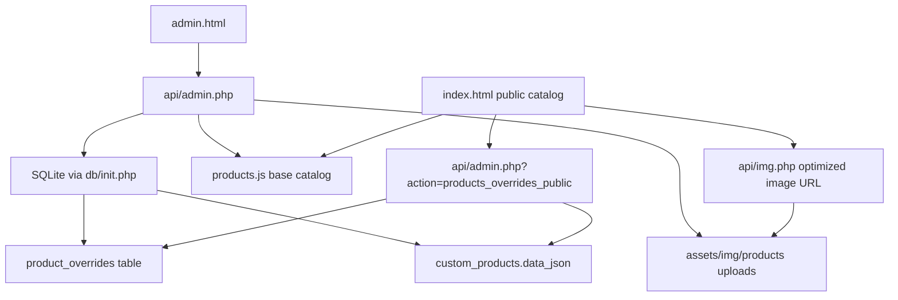

## 2026-07-06 ASCII Memory Snapshot
- Latest local production commits before this memory update: `12a800b Rewrite product descriptions from photos` and `8d7cd51 Correct product color descriptions`.
- Public catalog script version is `products.js?v=20260706b`.
- Catalog verified at 55 products: 31 `venki`, 24 `korzinki`; all 55 `descShort` and all 55 `descLong` values are unique.
- Second color audit corrected 11 palette mismatches in `products.js` after reviewing large photo contact sheets.
- Server SQLite cleanup cleared 48 generic `product_overrides.desc_short` placeholders so public cards/details use accurate base catalog color text.
- Server data backup before that cleanup: `/root/ritualb2b_sqlite_before_color_desc_short_20260706_204626.sqlite`.
- File backups before the color-audit deploy: `/root/ritualb2b_products_before_color_audit_20260706_234004.js` and `/root/ritualb2b_index_before_color_audit_20260706_234004.html`.
- Live checks: `products.js?v=20260706b` returned 55 products; public overrides API reported zero non-empty `desc_short`; Android Chrome detail check for `venok-dafna` matched the expected short and long description prefix with no horizontal scroll.
- Gotcha: keep `product_overrides.desc_short` null unless an intentional product-specific short override is needed; otherwise it masks `products.js`.
- Next follow-ups: promo edit UI, richer guest order workflow, deeper client/order detail views.

# Worklog: ritualb2b

## Current goal
Finish the admin panel edit workflow so product editing scrolls correctly on mobile/desktop, size can be assigned with buttons, and key admin actions are verified live.

## State (updated 2026-07-07)
- Done: Reproduced the user's mobile editor bug on Android Chrome through CDP. Before the fix, `.drawer-body` had `clientHeight=2261` and `scrollHeight=2261`, so touch gestures moved `windowScrollY` while the fixed drawer visually stayed stuck.
- Done: Fixed the root cause in `assets/css/admin-spa.css`: `.drawer-panel` now clips, the form is a flex column, `.drawer-body` has constrained height with `overflow-y:auto`, and `body.drawer-open` locks the page behind the drawer.
- Done: Added S/M/L size buttons in `assets/js/admin-spa.js` next to the manual size input; manual text entry remains the saved source of truth and button state syncs with the field.
- Done: Improved admin reliability: autosave selects/toggles disable while saving and roll back on API failure; settings save checks `config.php` write failure; current/last admin demotion is blocked; product save includes `active` in the same API request; custom product delete also clears matching overrides; Telegram report returns explicit errors.
- Done: Bumped admin asset cache to `20260707a` in `admin.html`.
- Done: Server backup before deploy: `/root/ritualb2b_admin_fix_20260707_133223`.
- Done: SQLite backup before QA writes: `/root/ritualb2b_sqlite_before_admin_qa_20260707_133409.sqlite`.
- Done: Deployed `admin.html`, `api/admin.php`, `assets/css/admin-spa.css`, and `assets/js/admin-spa.js`.
- Done: Verification: `node --check assets/js/admin-spa.js`; `git diff --check` (CRLF warnings only); server `php -l` on temp and live `api/admin.php`; live asset version `20260707a`.
- Done: Authenticated API QA passed for login/profile/products, self-demotion guard, temp product save/toggle/delete, temp override save/cleanup, promo create/toggle/delete, carousel save, settings save, CSV export, and Telegram report.
- Done: Android Chrome verified editor drawer scrolls internally (`scrollTop` moved to `775`), background does not scroll, size chip updates the input, no horizontal scroll, and drawer close clears `drawer-open`.
- Done: Desktop headless Chrome verified the same drawer/size behavior and UI Add Product -> Save -> Delete for a temporary custom product.
- Done: DB cleanup check after QA returned zero temp rows in `custom_products`, `product_overrides`, and `promo_rules`.
- Next: Commit and push the admin fix.

## State (updated 2026-07-06 late)
- Done: User provided live URLs: https://ritualb2b.ru/ and https://ritualb2b.ru/admin.html.
- Done: Local project identified at `C:\Users\user\Documents\GitHub\rituailb2b`.
- Done: Initial tree shows likely touchpoints: `admin.html`, `api_admin.php`, `api/admin.php`, `products.js`, `assets/img/products`.
- Done: Browser access initially failed with `net::ERR_NETWORK_CHANGED`; user later reported internet restored.
- Done: Live homepage visual reference captured; live admin currently stops at login screen.
- Done: Current product image model identified: base products and custom products use one `photo` field; upload endpoint returns one `filename`.
- Done: SSH access verified with `work/ritualb2b_deploy_ed25519` as `root@ritualb2b.ru`; server answered `ACCESS_OK`, `whoami=root`, `hostname=panel`, exit code 0.
- Done: Product count verified locally and live: 55 total products, 31 `venki`, 24 `korzinki`.
- Done: `products.js` now has 55 unique non-empty `descLong` descriptions and preserves `var PRODUCT_OVERRIDES = {};`.
- Done: `db/init.php` migration adds `photos_override` to `product_overrides`.
- Done: `api/admin.php` supports `photos_override`, multi-photo custom products, and active toggling for custom products.
- Done: `index.html` product detail supports thumbnail galleries and carousel uses the first effective product photo.
- Done: `admin.html` replaced with a separate SPA shell using `assets/css/admin-spa.css` and `assets/js/admin-spa.js`.
- Done: Checks run: `node --check assets/js/admin-spa.js`; `git diff --check`; product-count Node check; server PHP lint on temp copies of changed `api/admin.php` and `db/init.php`.
- Done: Server backup created at `/root/ritualb2b_backup_20260705_215852`.
- Done: Deployed `admin.html`, `index.html`, `products.js`, `api/admin.php`, `db/init.php`, `assets/css/admin-spa.css`, and `assets/js/admin-spa.js`.
- Done: Live checks passed: `php -l api/admin.php`, `php -l db/init.php`, `admin.html?v=20260705` HTTP 200, new CSS/JS HTTP 200, live `products.js` count 55 with 55 unique descriptions, public overrides API HTTP 200 with `photos_override`.
- Done: User provided admin credentials; initial login returned 401 because the stored admin password hash did not match the provided password.
- Done: Created pre-password-change SQLite backup at `/root/ritualb2b_sqlite_before_admin_password_20260705_224751.sqlite`.
- Done: Reset only the `phone='admin'` account to the user-provided password and verified authenticated API flow: login/profile/stats/products/orders/users/promos/analytics/settings/logout all returned HTTP 200 with `ok=true`.
- Done: Spawned parallel admin QA agents. Main findings: product area still felt raw, public cart used base price instead of override price, settings save could drop secrets, carousel save accepted unsafe empty/non-POST requests, hidden products could leak into carousel, and mobile product editing needed clearer visual treatment.
- Done: Local headless Chrome/CDP tested deployed admin login and all sections with `admin/admin123`; products drawer opened on desktop and mobile without JS/network errors.
- Done: Patch prepared locally: product catalog in admin now renders visual cards with large photo/miniatures/status/actions; product editor has live preview; upload/manual photo add is capped at 12 client-side; carousel UI and save ignore hidden products; settings include/preserve `WEBHOOK_SECRET`; public cart now uses effective override price; public hidden products are filtered from catalog, carousel, and deep links; duplicate public script includes removed; admin asset cache bumped to `20260705b`.
- Done: Checks after patch: `node --check assets/js/admin-spa.js`, `git diff --check` (only CRLF warnings), product count script (`55`, unique descriptions `55`), and server temp `php -l /tmp/ritualb2b_admin_patch.php`.
- Done: Server backup before patch deploy created at `/root/ritualb2b_admin_spa_patch_backup_20260705_231035`; CSS follow-up backup exists at `/root/ritualb2b_admin_spa_css_before_filter_tweak_.css`.
- Done: Deployed patched `admin.html`, `api/admin.php`, `index.html`, `assets/js/admin-spa.js`, and `assets/css/admin-spa.css`; final admin asset cache version is `20260705d`.
- Done: Live verification after deploy: `php -l api/admin.php`; `admin.html`, CSS, JS all HTTP 200; admin auth/API (`profile`, `stats`, `products_list`, `settings_get`) returned 200; `carousel_save` GET returned 405 and invalid POST returned 422; products live count is 55 with 55 unique descriptions.
- Done: Headless Chrome final checks: desktop product list renders 55 visual cards, main card images load (`naturalWidth=180`), no product table wrapper, filters stay one row, no horizontal scroll, no JS exceptions/HTTP failures; product editor drawer has preview + photo input; mobile drawer is 390px wide with preview/photo input/save visible and no horizontal scroll.
- Done: Public cart override verified in browser without creating an order: `venok-garmonia` base price 2700 uses override price 1290 in session cart.
- Done: Reworked all 55 base product descriptions in `products.js` against the actual product photos/color palettes after the user rejected the previous generic copy; all `descShort` and `descLong` values are unique and non-empty.
- Done: Bumped the public catalog script tag in `index.html` to `products.js?v=20260706a` because the connected Android phone still had the old unversioned catalog cached.
- Done: Server backups before this copy/cache update: `/root/ritualb2b_products_before_photo_copy_20260706_231003.js` and `/root/ritualb2b_index_before_products_cache_bust_20260706_231309.html`.
- Done: Live verification after copy/cache update: HTTPS `products.js` returned 55 products with 55 unique short/long descriptions; local and server SHA-256 for `products.js` matched; connected Android Chrome saw 55 products, expected new sample descriptions, visible updated text, 360px scroll width, and no horizontal scroll.
- Done: Second color audit correction in `products.js` after visual contact-sheet review: corrected 11 mismatched color palettes and bumped public catalog cache to `products.js?v=20260706b`.
- Done: Cleared 48 server `product_overrides.desc_short` values that were the generic placeholder `Авторская работа · Искусственные цветы`; this lets public cards/details fall back to the accurate `products.js` color descriptions while preserving prices, dimensions, active flags, photos, and other overrides.
- Done: Server backups for this color-audit pass: `/root/ritualb2b_products_before_color_audit_20260706_234004.js`, `/root/ritualb2b_index_before_color_audit_20260706_234004.html`, and `/root/ritualb2b_sqlite_before_color_desc_short_20260706_204626.sqlite`.
- Done: Live/mobile verification after the second color audit: HTTPS `products.js?v=20260706b` returned 55 products with 55 unique short/long descriptions; public overrides API has `withDescShort=0`; connected Android Chrome loaded `products.js?v=20260706b`, opened `Венок «Дафна»`, matched the expected short and long description prefix, and had no horizontal scroll.
- Next: Broader UX follow-ups remain: promo edit UI, richer guest order workflow, and deeper client/order detail views.

## System Map

## Decisions
- 2026-07-05 Use the public site as the visual reference for admin styling because the user explicitly wants the admin panel in the same overall style as the site.
- 2026-07-05 User approved implementation with "делай это"; proceed with a surgical vanilla SPA without build tooling to preserve the current hosting model and URL.
- 2026-07-05 Use `INSERT ... ON CONFLICT DO UPDATE` for product overrides instead of `INSERT OR REPLACE` so saving descriptions/photos does not wipe the product active flag.
- 2026-07-05 Keep the admin SPA as vanilla HTML/CSS/JS with no build step because the host already serves static files directly and this keeps deployment surgical.
- 2026-07-05 Make product cards the visual unit rather than putting a table inside another card; this better matches the user's request for modern, clear product management.

## Gotchas
- The repository is not under the generated chat folder; it is in `C:\Users\user\Documents\GitHub\rituailb2b`.
- No local SQLite database file was found in the repository, so logged-in admin state cannot be reproduced from existing local data.
- Local PHP is unavailable; PHP syntax checks must run on the server or on temp server copies.
- The user's default `known_hosts` has a stale host key for `ritualb2b.ru`; use the isolated file `work/ritualb2b_known_hosts` for SSH commands unless the user wants to clean their local known_hosts.
- The in-app browser is unavailable in this Codex session (`agent.browsers.list()` returned `[]`), so visual browser screenshots cannot be produced here.
- `curl.exe` JSON quoting under PowerShell can distort request bodies; use Node HTTPS or PowerShell hashtables/ConvertTo-Json for auth checks.
- `scp` to this host can close unexpectedly while SSH still works; for temp byte transfer, `cmd /c` with OpenSSH stdin redirection worked.
- Admin product main images should not use native lazy loading; in headless/live QA they could appear blank while miniatures loaded.
- The public homepage previously loaded `products.js` without a version query; mobile Chrome kept stale product text until `index.html` was updated to `products.js?v=20260706a`.
- Server `product_overrides.desc_short` can mask accurate base catalog text. On 2026-07-06, 48 rows had the generic placeholder `Авторская работа · Искусственные цветы`; clearing those values made the public site use `products.js` descriptions again.

## Open threads
- Promo editing and richer order/client workflows are still broader UX follow-ups; this patch focuses on the raw admin product/photo experience and the blocker bugs found by QA agents.
